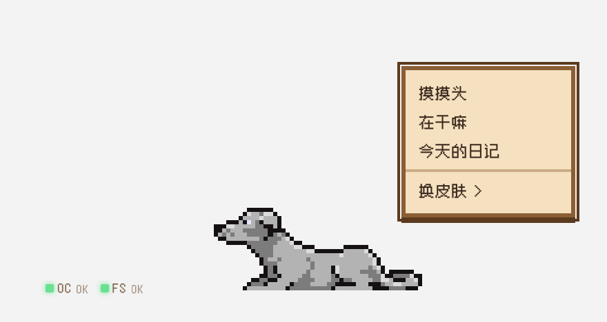
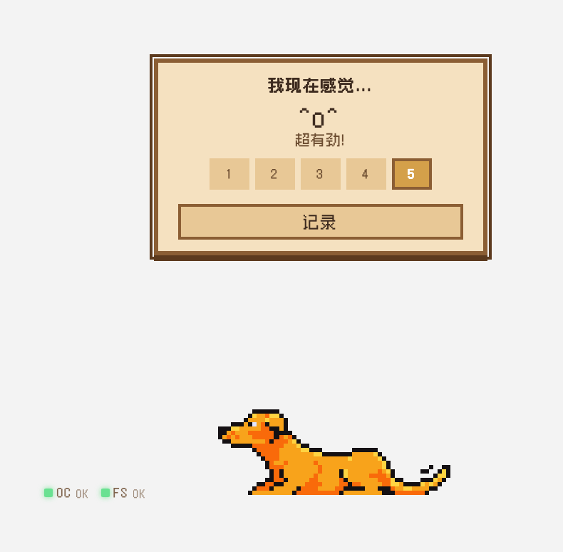
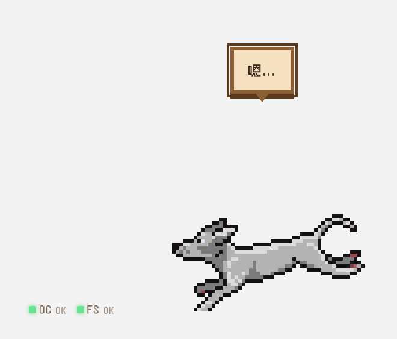
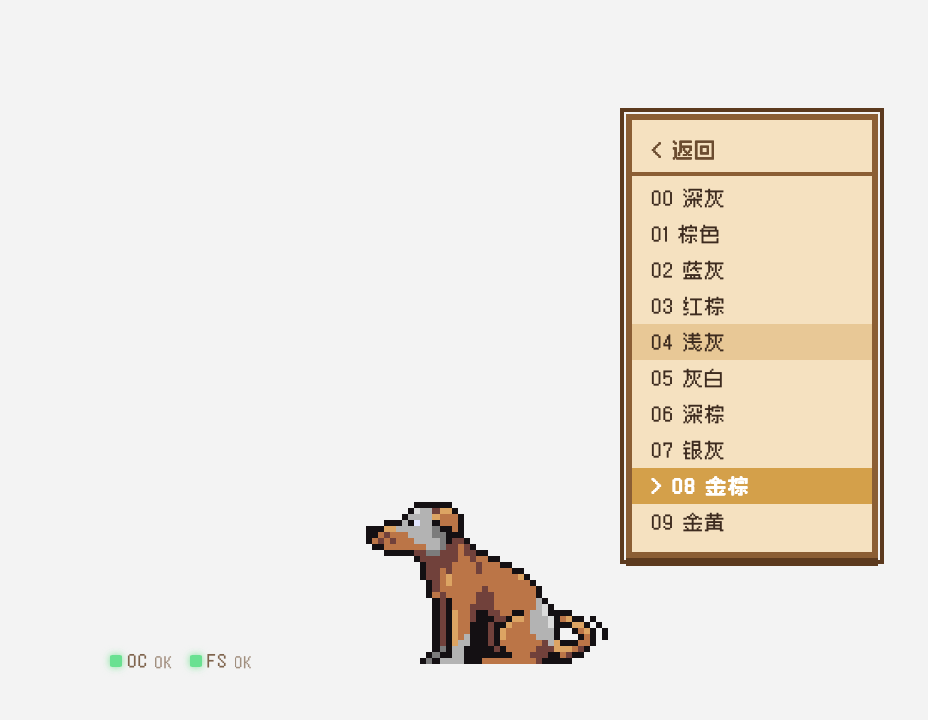

# 关爱创业狗

**一只像素狗，陪你创业。**

基于 [OpenClaw](https://github.com/NoDeskAI/nodeskclaw) + 飞书 + Cursor/Claude Code 数据，驱动一只 macOS 桌面像素宠物狗，用动画和对话反映你的工作状态。

<p align="center">
  
  
</p>
<p align="center">
  
  
</p>
<p align="center">
  
</p>

---

## 产品哲学

### 狗是你的投射，不是你的助手

这只狗不是来"关心你"的 —— 它**就是你**。

创业者不缺建议。每个人都知道该喝水、该休息、该运动。他们缺的是三样东西：

- **被看见** — 不是被提醒，是有一个东西在默默反映"你现在的状态是这样的"。不评判，不指导，就是让你看到自己。
- **被允许** — 创业者最大的心理负担是"我不应该累"。如果狗趴下了，用户会说"不是我要休息，是我的狗需要休息"。
- **被陪伴** — 系统推送提醒像老板，狗默默跟你经历一切像朋友。

### 双需求模型：被看见 vs 被抽离

创业者有两种截然不同的心理需求：

| | 需求 A：被看见 | 需求 B：被抽离 |
|---|---|---|
| **心理机制** | "有人知道我在努力" | "让我喘口气" |
| **触发** | 右键 → 在干嘛 / 今天的日记 / cron 自言自语 | 右键 → 摸摸头 |
| **内容** | 基于真实工作数据的伙伴式反馈 | 与工作完全无关的有趣短文本 |

"摸狗头"本身就暗示了一个心理模型：你在跟一只狗玩，不是在听工作周报。真正的狗被摸头会翻肚皮、甩尾巴、叼个什么东西给你看 —— 纯粹的微笑瞬间。

### 文案视角

狗是创业伙伴，不是旁观者、数据播报员或心理咨询师：

- **"我们"** — 共同经历的辛苦（"我们已经调了好久的前端视觉了！"）
- **"你"** — 赞美和鼓励（"你真厉害"）
- **"我们"** — 休息建议（"我们下去遛遛吧！"）

狗没有独立需求。不说"我饿了"。休息提议永远是"我们一起"。

---

## 交互机制

| 操作 | 效果 |
|------|------|
| **左键点击** | 心情面板（1-5 档），记录到本地数据库 |
| **右键 → 摸摸头** | 从预生成 fun-pool 随机取一条趣味文案，零延迟（需求 B） |
| **右键 → 在干嘛** | 调用 LLM 生成基于真实工作内容的伙伴式反馈（需求 A） |
| **右键 → 今天的日记** | 当天叙事回顾 + 心情时间线 |
| **右键 → 换皮肤** | 10 款像素狗皮肤 |
| **悬停** | 显示 LLM 预生成的状态描述 |
| **拖拽** | 移动狗的位置（4px 死区区分点击，屏幕边界约束） |

### 自动机制

| 机制 | 频率 | 说明 |
|------|------|------|
| 主动询问 | 每 2 小时 | 弹窗问心情状态，选择后记入数据库 |
| 数据采集 | 每 10 分钟 | 读取飞书消息计数 + 编码活动，更新 energy |
| 完整分析 | 每 1 小时 | LLM 情绪分析 + 生成自言自语 + 刷新 fun-pool |
| 连接指示 | 实时 | 左下角 OC/FS 状态灯（绿/黄/红） |

### 狗的动画

完全由用户自报心情决定：

| 心情 | 动画 | 标签 |
|------|------|------|
| 5 | 奔跑 | 冲冲冲! |
| 4 | 走路 | 走走走~ |
| 3 | 坐着 | 有点累了... |
| 2 | 趴着 | 歇会儿... |
| 1 | 睡觉 | zzZ... |

### 日期边界

"今天"从凌晨 4 点算起，适配创业者作息。

---

## 数据架构

```
~/.创业狗/
├── status.json           # OpenClaw cron 输出（energy, 消息数, 工作摘要, hover_text）
├── comfort-message.json  # LLM 生成的安慰/自言自语
├── fun-pool.json         # cron 预生成的 5 条趣味文案
├── user-response.json    # 用户交互反馈
├── activity.jsonl        # Cursor/Claude Code hooks 写入的编码活动
├── config.json           # 飞书表 ID 等配置
└── dog.db                # SQLite（心情记录 + 工作快照）
```

三个数据源：
1. **飞书** — 消息内容、消息量、日程（第一优先级）
2. **Cursor IDE** — prompt 文本、session 时长
3. **Claude Code** — prompt 文本、session 时长

---

## 安装

### 前提

- [OpenClaw](https://github.com/NoDeskAI/nodeskclaw) 已安装并连接飞书
- macOS (Apple Silicon)

### 安装 Skill

```bash
cp -r skill ~/.openclaw/workspace/skills/caring-startup-dog
```

### 初始化

告诉你的 OpenClaw：

> "帮我初始化 caring-startup-dog"

自动完成：创建数据目录 → 安装 Hooks → 创建飞书表 → 配置 Cron → 安装桌面宠物。

### 手动安装桌面宠物

从 [Releases](https://github.com/NoDeskAI/caring-startup-dog/releases) 下载。

---

## 项目结构

```
├── skill/              # OpenClaw Skill
│   ├── SKILL.md        # Skill 定义与操作流程
│   ├── prompts/        # LLM Prompt 模板
│   └── scripts/        # 安装脚本
├── desktop-pet/        # Tauri 桌面宠物源码
│   ├── src/            # React + Phaser 前端
│   └── src-tauri/      # Rust 后端（穿透、拖拽、光标检测）
├── hooks/              # Cursor/Claude Code Hooks
└── docs/               # 产品文档与截图
```

## 技术栈

- **Skill**: OpenClaw + 飞书 API + LLM
- **桌面宠物**: Tauri v2 + React + Phaser 3 + Zustand + SQLite
- **窗口交互**: cocoa/objc（macOS 原生 API） + screenX/Y 拖拽 + Rust 光标轮询
- **像素素材**: [Pixel Dogs by Benvictus](https://bfreddyberg.itch.io/pixel-dogs)
- **像素字体**: Zpix（中文） + Silkscreen（英文）

## 协议

[Apache License 2.0](LICENSE)
